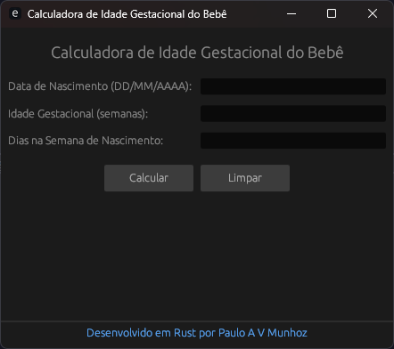

# Calculadora de Idade Gestacional do Bebê 👶

Uma aplicação de desktop simples e eficiente, desenvolvida em Rust, para calcular a idade cronológica e a idade corrigida de bebês, especialmente útil para acompanhar o desenvolvimento de prematuros.



---

## ✨ Funcionalidades

- **Cálculo de Idade Cronológica:** Determina a idade exata do bebê em anos, meses, dias, semanas totais e meses totais.
- **Cálculo de Idade Corrigida:** Ajusta a idade do bebê com base na prematuridade, considerando uma gestação a termo de 40 semanas.
- **Interface Gráfica Amigável:** Interface limpa e intuitiva construída com a biblioteca `egui`.
- **Copiar Resultados:** Um botão para copiar facilmente os resultados calculados para a área de transferência.
- **Navegação por Teclado:** Use a tecla `Enter` para navegar entre os campos de preenchimento e para acionar o cálculo.
- **Janela Fixa:** A janela da aplicação não é redimensionável para garantir uma experiência de usuário consistente.

---

## 🚀 Como Compilar e Executar

Para compilar e executar este projeto localmente, siga os passos abaixo.

### Pré-requisitos

- É necessário ter o **Rust** e o **Cargo** instalados em sua máquina. Se não os tiver, você pode instalá-los através do [rustup](https://rustup.rs/).

### Passos

1.  **Clone o repositório:**
    ```sh
    git clone [https://github.com/seu-usuario/nome-do-repositorio.git](https://github.com/seu-usuario/nome-do-repositorio.git)
    ```

2.  **Navegue até o diretório do projeto:**
    ```sh
    cd nome-do-repositorio
    ```

3.  **Compile o projeto em modo de lançamento (release):**
    ```sh
    cargo build --release
    ```

4.  **Execute a aplicação:**
    O executável será gerado no diretório `target/release/`.
    ```sh
    ./target/release/nome-do-executavel
    ```

---

## 📦 Dependências

Este projeto utiliza as seguintes bibliotecas (crates):

-   [`eframe`](https://crates.io/crates/eframe): Para a criação da interface gráfica.
-   [`chrono`](https://crates.io/crates/chrono): Para manipulação de datas e horas.
-   [`arboard`](https://crates.io/crates/arboard): Para interagir com a área de transferência do sistema.

As dependências são gerenciadas automaticamente pelo Cargo.

---

## 👤 Autor

Desenvolvido com ❤️ em Rust por **Paulo A. V. Munhoz**.

[](https://www.linkedin.com/in/paulomunhoz/)

